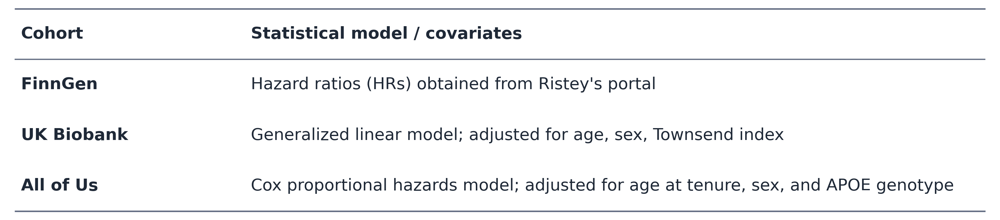
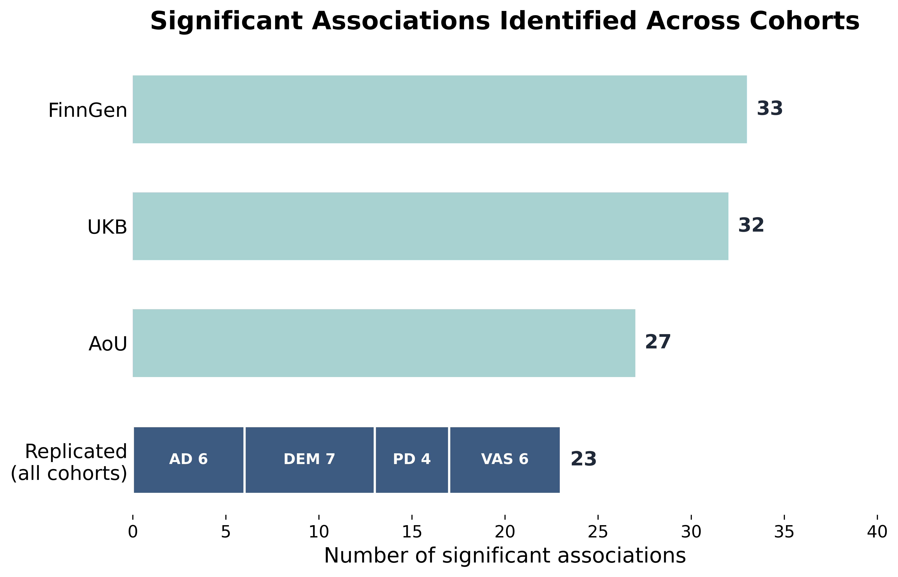

# Bacterial Infections & Neurodegenerative Disease Risk Across National Biobanks 

### Project Overview
Hypothesis-free evaluation of bacterial infections associated with neurodegenerative diseases across UK Biobank (UKB), FinnGen, and All of Us (AoU).

Neurodegenerative Diseases (NDDs) Evaluated:
-  Alzheimer's Disease (AD)
-  Amyotrophic Lateral Sclerosis (ALS)
-  Parkinson's Disease
-  Dementia (DEM)
-  Vascular Dementia (VAS)

Analyses:
- Hypothesis - free association screening
- Replication across cohorts
- Lag-time analyses evaluating the influence of infection timing (FinnGen and AoU)

###### Table 1. Summary of Cohort Analyses 

### Notebook Guide 
- Language: Python

#### UKB 
| Notebook | Description |
|----------|-------------|
| `UKB_bacteria-Copy1.ipynb`|Loads UK Biobank participant, infection, and covariate data, runs regression models, and generates association results|

#### FinnGen 
| Notebook | Description |
|----------|-------------|
| `finngen_bacteria-Copy1.ipynb`|Loads FinnGen survival analysis results and extracts hazard ratios for bacterial infection–neurodegenerative disease associations at lag 0 (any infection prior to tenure) and lag-time analyses (<1 year, 1–5 years, and 5–15 years before tenure).|

#### AoU 
| Notebook | Description |
|----------|-------------|
| `01_pull_NDD_rule_of_two_MAY_15_2026 (2).ipynb`|Pulls all valid cases for each of the five NDDs using the rule of two|
| `02_controls_ (1).ipynb` |Creates the controls by ensuring they match the UKB data|
| `03_pull_ICD10_data (2) (2).ipynb` |Pulls all of the ICD10 codes that will be used to assess relationships with NDDs |
| `04_prep_CONTROL_JUNE_01_2026 (1) (1).ipynb` |Loads the control cohort, incorporates death records and recruitment information, computes derived variables (e.g., tenure and age at tenure), and applies final eligibility|
|`04_prep_NDD_june_01_26_rule_of_two (1) (1).ipynb` |Loads the NDD cases cohort, incorporates death records and recruitment information, computes derived variables (eg.,tenure and age at tenure), and applies final eligibility|
|`05_prep_COMBO(FinnGen) (1).ipynb` |Prepares combined case and control datasets using FinnGen bacterial infection groupings. Removes duplicate participants, creates lag-time variables for timing analyses, and adds APOE genotype information for Cox regression models|
|`05_prep_COMBO(ICD10) (1).ipynb` |Prepares combined case and control datasets using direct ICD10 bacterial infection codes. Removes duplicate participants, creates lag-time variables, and incorporates APOE genotype information for subsequent analyses|
|`06_run_COX(FinnGen).ipynb` |Fits Cox proportional hazards models using FinnGen bacterial infection groupings. Evaluates overall associations (lag 0) and lag-time analyses (<1 year, 1–5 years, and 5+ years before tenure)|
|`06_run_COX-Copy1(ICD10).ipynb`|Fits Cox proportional hazards models using direct ICD10 bacterial infection codes, evaluating associations between infections and neurodegenerative diseases at lag 0 (any infection prior to tenure)|
|`07_Plots.ipynb`|Generates figures, including forest plots, bar charts, and other summary visualizations|
|`07_Tables.ipynb` |Generates publication-ready tables summarizing cohort characteristics, association results, and selected analysis subsets|

### Results 
###### Figure 1. Summary of Significant Associations Across Biobanks

​

###### Figure 2. Forest Plots Representing All FDR Significant (p < 0.05) Bacterial Infection - NDD Pairs Replicated Across All Three Biobanks ​

###### Figure 3. Forest Plots Representing All FDR Significant (p < 0.05) Lag Associations For Bacterial Infection - NDD Pairs Replicated Across FinnGen and AoU​

